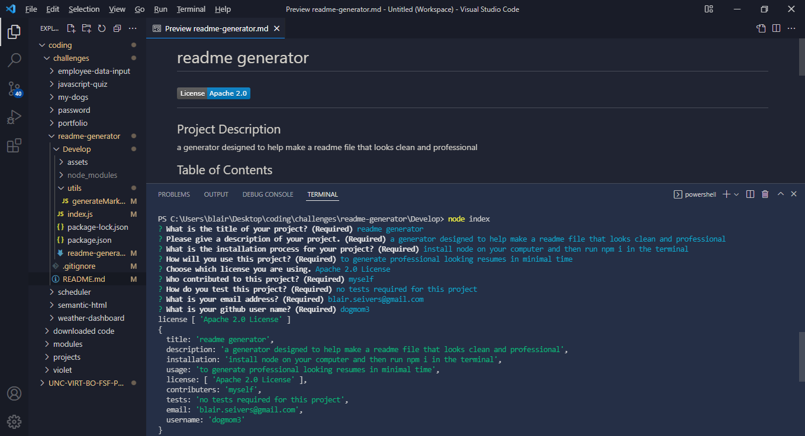

# PROFESSIONAL README GENERATOR

## Description
My motivation in creating this file generator is to expand my knowledge with using Node.Js.
I built this project to assist in making professional README.md files.
This will make them a lot quicker and simpler to do thus allowing me to focus on other aspects of the project.
I learned how to use Node.js and the inquirer package to help further my coding abilities.

## Table of Contents 

- [Installation](#installation)
- [Usage](#usage)
- [Credits](#credits)

## Installation

Install Node on your computer. Run 'npm i' in the appropriate directory in your terminal. Make sure you are in the correct file directory adn type 'node index' in the terminal to begin a series of questions to help generate your README file.

## Usage

## Credits

created by Blair Seivers
